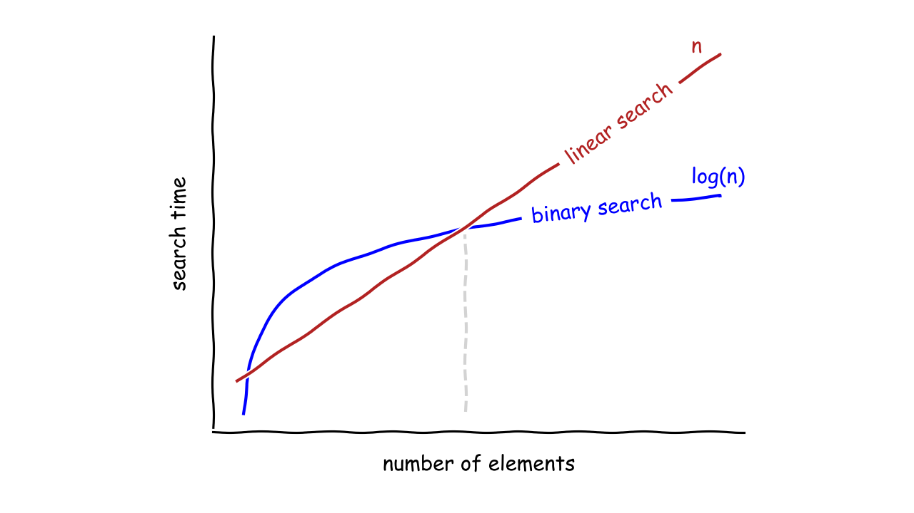

# Linear & Binary Search Algorithms

Linear Search Algorithm

The Linear Search Algorithm is a sequential search algorithm that starts from one end and checks each element of the list being searched until the desired element is found.

If the searched element is the last element of the list, then it is necessary to check all the elements of the list. The Time Complexity of the algorithm, in the Worst Case scenario, assuming the number of elements in the searched list is n, is O(n).

Binary Search Algorithm

The Binary Search Algorithm is an efficient algorithm used to search for a specific value in a sorted list. The algorithm repeatedly divides the search range in half until the target value is found or there are no more elements in the search range.

To perform binary search, you start by comparing the target value with the middle element of the sorted list. If the target value is smaller than the middle element, you eliminate the upper half of the search range and repeat the process with the lower half. If the target value is greater than the middle element, you eliminate the lower half of the search range and repeat the process with the upper half. This process continues until the target value is found or there are no elements left in the search range.

The Time Complexity of the algorithm, in the Worst Case scenario, assuming the number of elements in the search list is n, is O(log n). This makes it a popular choice for searching large datasets. However, binary search can only be used on sorted lists or arrays, so it may not be suitable for every scenario.

You can access my article on the topic through the Medium link: https://medium.com/@ozgurmehmetakif/linear-binary-search-algorithms-7f529c470a2b

Konu hakkındaki yazıma Medium linkinden ulaşabilirsiniz: https://medium.com/@ozgurmehmetakif/do%C4%9Frusal-i%CC%87kili-arama-algoritmalar%C4%B1-linear-binary-search-algorithms-ed5fefc1f003

  
