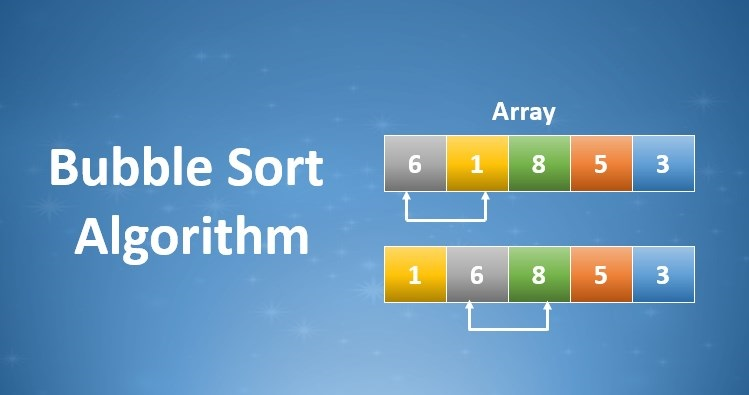

# Bubble Sort Algorithm

Bubble Sort Algorithm is an easy sorting algorithm that relies on the swapping of elements that are in the wrong order. This swapping process continues until the entire list is sorted.

You can access my article on the topic through the Medium link: https://medium.com/@ozgurmehmetakif/bubble-sort-algorithm-13072f8ec6b2

Konu hakkındaki yazıma Medium linkinden ulaşabilirsiniz: https://medium.com/@ozgurmehmetakif/kabarc%C4%B1k-s%C4%B1ralama-algoritmas%C4%B1-bubble-sort-algorithm-e44e72b43e80
  
