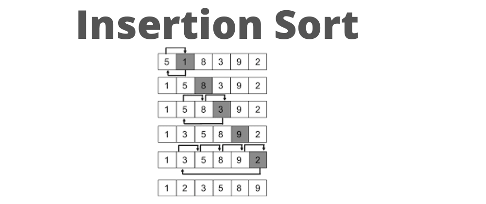

# Insertion Sort Algorithm

Insertion Sort Algorithm compares values in a list starting from the second value. If the value is greater than the one to its left, no changes are made. Otherwise, the value is repeatedly shifted to the left until it encounters a smaller value.

You can access my article on the topic through the Medium link: https://medium.com/@ozgurmehmetakif/insertion-sort-algorithm-07e07266ec34

Konu hakkındaki yazıma Medium linkinden ulaşabilirsiniz: https://medium.com/@ozgurmehmetakif/eklemeli-s%C4%B1ralamaalgoritmas%C4%B1-insertion-sort-algorithm-afcd97d8a446
  
