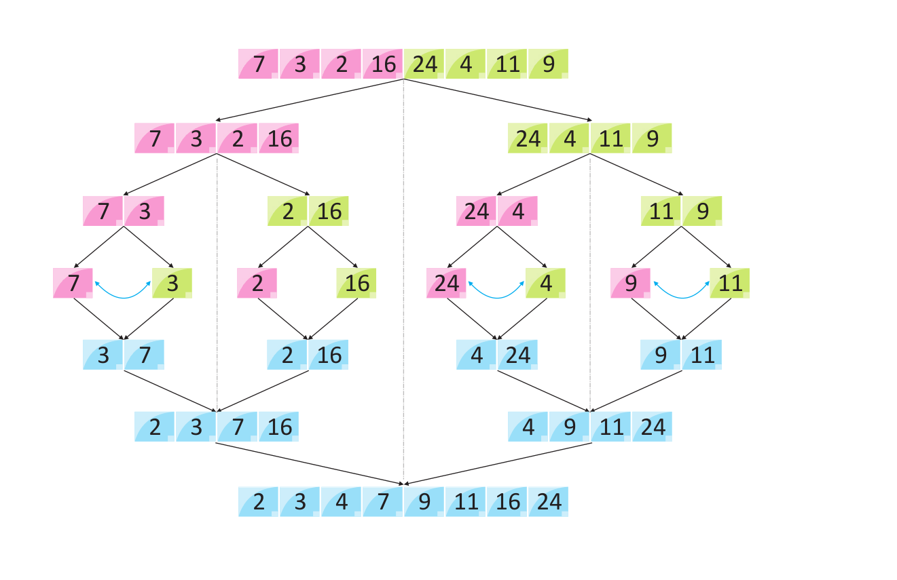

# Merge Sort Algorithm (Birleştirmeli Sıralama Algoritması)

  Birleştirmeli Sıralama Algoritması, sıralanması gereken listeyi böldüğümüz, küçük parçalar halinde sıraladığımız, sonra tekrar bir araya getirdiğimiz klasik bir “Böl ve Fethet” (Divide and Conquer) algoritmasıdır.

Böl ve Fethet Konsepti üç kavramdan oluşur:

Problemi birden fazla alt problemlere bölün.
Alt problemleri kendi içerlerinde çözün.
Asıl problemin çözümüne ulaşmak için çözülmüş alt problemleri birleştirin.

Konu hakkındaki yazıma Medium linkinden ulaşabilirsiniz: https://medium.com/@ozgurmehmetakif/birle%C5%9Ftirmeli-s%C4%B1ralama-algoritmas%C4%B1-merge-sort-algorithm-c8a0feacc53
  