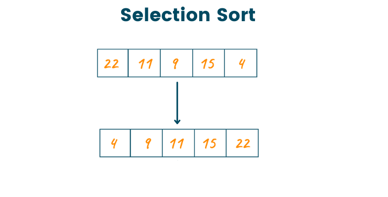

# Selection Sort Algorithm

Selection Sort Algorithm is a sorting algorithm that, in each iteration, selects the smallest element from the unsorted list and swaps it with the element at the beginning of the unsorted list. This selection and swapping process continues until the entire list is sorted.

You can access my article on the topic through the Medium link: https://medium.com/@ozgurmehmetakif/selection-sort-algorithm-1c1cfcadc7a9

Konu hakkındaki yazıma Medium linkinden ulaşabilirsiniz: https://medium.com/@ozgurmehmetakif/se%C3%A7erek-s%C4%B1ralama-selection-sort-e8ccff14a6e7
  
